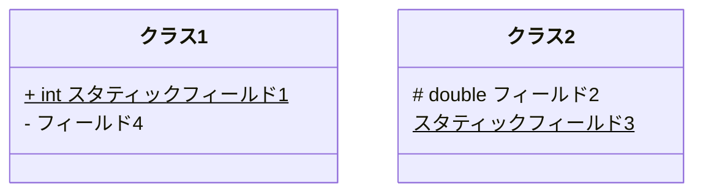
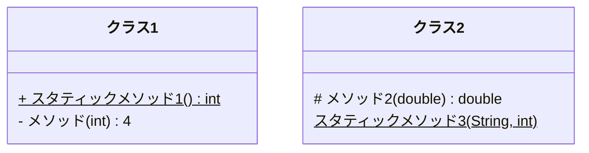
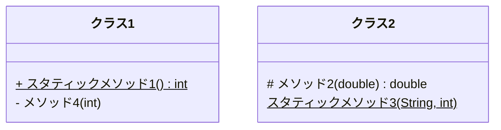
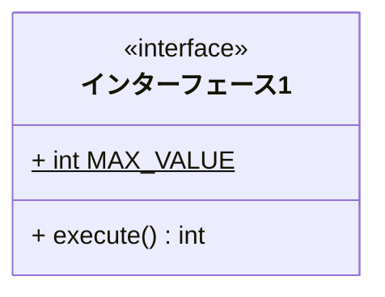
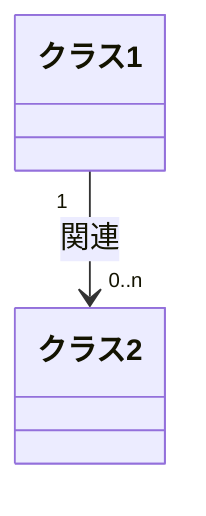
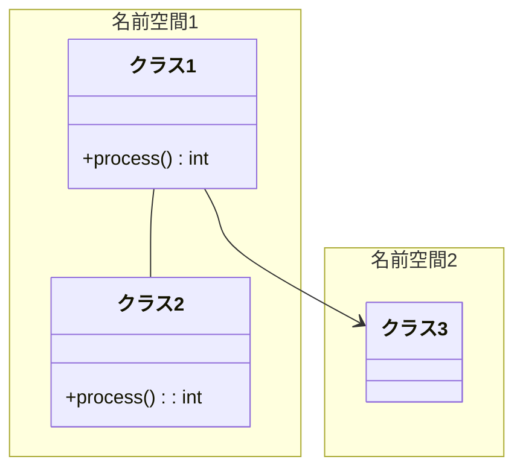
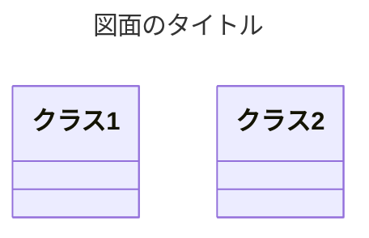
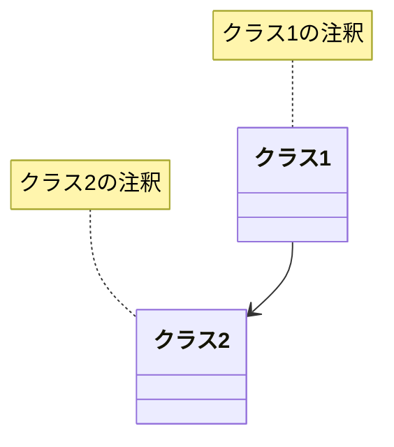

# クラス図について
Mermaidでのクラス図の描き方について簡単に見ていこうと思います。

GitHubではmarkdownファイルにコードブロックとして埋め込むことでMermaidでの図形記述が利用できます。

例えばクラス定義をmarkdownファイルに埋め込む場合には以下のように記述します。
~~~

~~~
上のように記述することでmarkdownファイルには以下のようにクラス定義が表示されるようになります。

以下、クラス図の構成要素についてみていきます。
## クラス定義
クラス定義は上でも見たように`class クラス名`の形式で記述します。
### フィールド定義
フィールドは以下の形式で記述します。
```
クラス名: [可視性] [型] フィールド名 [分類]
```
`クラス名`はそのフィールドが所属するクラスのクラス名で、`フィールド名`とともに必須の項目となります。

`可視性`はフィールドの可視性を指定する1文字の記号で、以下のものが使用でき、省略も可能です。

- `+`: パブリック
- `#`: プロテクテッド
- `~`: パッケージプライベート
- `-`: プライベート

`型`はフィールドの型を指定する文字列で省略可能です。

`分類`にはスタティックフィールドの場合`$`を記入することができます。

フィールド定義の例を以下に示します。
~~~

~~~
これを表示すると以下のようになります。

上に示したようにフィールド定義は特に順序は問われません。
### メソッド定義
メソッドは以下の形式で記述します。
```
クラス名: [可視性] メソッド名([引数]) [型] [分類]
```
`クラス名`はそのメソッドが所属するクラスのクラス名で、`メソッド名`とともに必須の項目となります。
また、メソッド名の後の括弧も必須です。

`可視性`はメソッドの可視性を指定する1文字の記号で、フィールドと同様に以下のものが使用でき、省略も可能です。

- `+`: パブリック
- `#`: プロテクテッド
- `~`: パッケージプライベート
- `-`: プライベート

`引数`はメソッドの引数を指定する文字列で、省略可能です。

`型`はメソッドの戻り値型を指定する文字列で省略可能です。

`分類`にはスタティックメソッドの場合`$`を記入することができます。

メソッド定義の例を以下に示します。
~~~

~~~
これを表示すると以下のようになります。

### インターフェース定義 (ステレオタイプ)
インターフェースなどクラスへのステレオタイプの記述は`<<ステレオタイプ>> クラス名`の形式で記述します。

インターフェース定義の例を以下のようなものになります。
~~~

~~~

### クラス定義の別の記述方法
ここまではクラス定義とメンバー定義を別々に記述する方法についてみてきましたが、Mermaidはクラス定義を一括して記述する方法も提供しています。

以下に例を示します。
~~~
```mermaid
classDiagram
  class クラス1 {
    + int MAX_VALUE$
    - double currentValue
    + process(int) double
  }
  class インターフェース2 {
    <<inteface>>
    + process(int) double
  }
  ```
~~~
```mermaid
classDiagram
  class クラス1 {
    + int MAX_VALUE$
    - double currentValue
    + process(int) double
  }
  class インターフェース2 {
    <<inteface>>
    + process(int) double
  }
  ```
この記述方法を使うとメンバー定義にクラス名を記述する必要がなくなるため、すっきりとします。

## 関連の記述
関連は`クラス名 [多重度] [関連の種類] [多重度] クラス名 [:ラベル]`という形式で記述します。

関連の例を示します。
~~~
```mermaid
classDiagram
  class クラス1
  class クラス2
  クラス1 "1" --> "0..n" クラス2: 関連
```
~~~

ラベルは関連の線上に表示されるので、ロール名として使うには無理があります。

### 関連の種類
Mermaidでは以下のような関連を記述することができます。
- `<|--`: 汎化
- `*--`: コンポジション
- `o--`: 集約
- `-->`: 誘導可能な関連
- `--`: 関連
- `..>`: 依存
- `..|>`: 実現
- `..`: 点線

以下にこれらの関連を使用した例を示します。
~~~
```mermaid
classDiagram
  class スーパークラス
  class インターフェース
  <<interface>> インターフェース
  class サブクラス1
  class サブクラス1の中身1
  class サブクラス1の中身2
  class サブクラス2
  class サブクラス2の中身
  class 別のクラス
  スーパークラス <|-- サブクラス1
  スーパークラス <|-- サブクラス2
  インターフェース <|.. サブクラス1
  サブクラス1 --> 別のクラス
  サブクラス1 o-- サブクラス1の中身1
  サブクラス1 o-- サブクラス1の中身2
  サブクラス2 *-- サブクラス2の中身
  別のクラス ..> サブクラス2
  ```
~~~
```mermaid
classDiagram
  class スーパークラス
  class インターフェース
  <<interface>> インターフェース
  class サブクラス1
  class サブクラス1の中身1
  class サブクラス1の中身2
  class サブクラス2
  class サブクラス2の中身
  class 別のクラス
  スーパークラス <|-- サブクラス1
  スーパークラス <|-- サブクラス2
  インターフェース <|.. サブクラス1
  サブクラス1 --> 別のクラス
  サブクラス1 o-- サブクラス1の中身1
  サブクラス1 o-- サブクラス1の中身2
  サブクラス2 *-- サブクラス2の中身
  別のクラス ..> サブクラス2
```
と、とりあえず一通りの関連は記述できます。

### 多重度
多重度は矢印の片側、あるいは両側に記述することができます。

多重度として以下のものが使用できます。
- "1": 1
- "n": n
- "0..1": 0または1
- "0..n": 0からn
- "1..n": 1からn
- "*": 0以上
- "1..*": 1以上
多重度は上のように二重引用符 (") で囲まれた形式で指定してください。

### ラベル
関連を指定する行のコロン (:) の後に任意の文字列をラベルとして指定することができます。

ラベルは関連の中ほどに1個だけ表示されるので、ロール名としては使いにくいかもしれません。

## 名前空間
パッケージやモジュールなどのクラスのまとまりを名前空間として表現できます。

名前空間は`namespace 名前空間名 {`で始まる行と`}`でおわる行でクラスを挟み込みます。

名前空間の使用例を示します。
~~~

~~~

名前空間にはクラス定義だけを含むことができ、独立したフィールド定義やメソッド定義、関連の定義などは含むことができません。

また、当然ですが名前空間の異なるクラス間の関連を記述することは問題ありません。

## その他の記述形式
その他の記述形式として図面のタイトルと注釈、コメントの記述についてみておきます。

### 図面のタイトル
図面のタイトルはクラス図の範囲外の機能で、`classDiagram`の前に例で示したように記述します。
~~~

~~~


### 注釈
クラスに注釈をつけたいときは`note for クラス名 "注釈文字列"`の形式を使用します。

いかに注釈の例を示します。
~~~

~~~

関連には名前がないので注釈をつけることができません。

### コメント
コメントは`%% コメント文字列`形式で記述します。

「%%」から行末までがコメントと扱われ、図面には影響しません。

## まとめ
以上、Mermaidでのクラス図の記述方法についてみてきました。

なお、公式サイトの以下のページにクラス図の文法詳細がありますので、参考にしてください。

[https://docs.mermaidchart.com/mermaid-oss/syntax/classDiagram.html](https://docs.mermaidchart.com/mermaid-oss/syntax/classDiagram.html)
