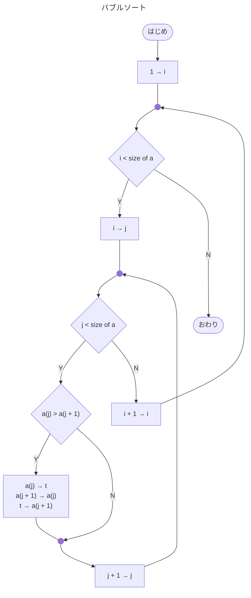
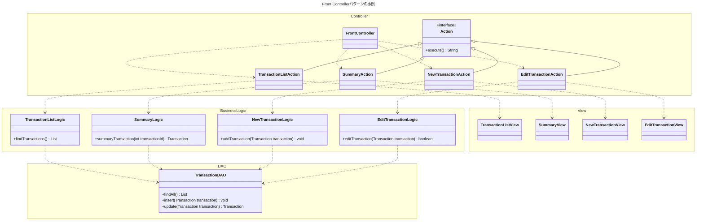
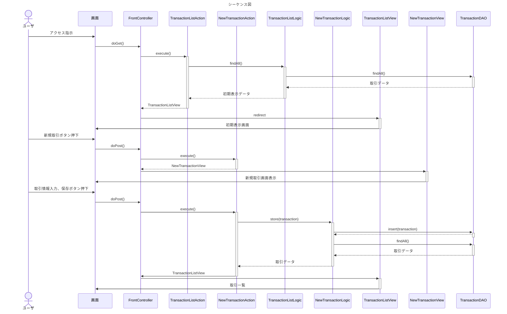

# mermaidのサンプル
markdownで図面を作成する[mermaid](https://www.mermaidchart.com/)を使ってみました。

mermaidはmarkdownのソースコードブロックとしてフローチャートやクラス図などを記述する文書形式です。
mermaidはGitHubで使用できるだけでなく、VisualStudio Codeなどのアドインとして提供されているので、設計図面を簡単に文書化してソースコードとともに管理することができます。

mermaidで記述した図面のサンプルをいくつか示します。

## フローチャート
フローチャートを書いてみます。

判断記号のひし形の縦横比が微妙とか、判断の矢印が出る位置が気持ち悪いとか、ループの開始端はあるのに終了端がないとか、流れが両側に振り分けられるレイアウトになるので、主となる流れが分かりにくいとか微妙な点がいろいろとありますが、とりあえずフローチャートを描くことはできます。

## クラス図
クラス図を描いてみます。

関連があまり見やすくないけれど、それなりに使えそうなクラス図ができました。
もちろんここからコード化できるわけではない、単なるお絵描きツールですがソースコードとともに管理できるのできちんと規律が守られていればそれなりに使えると思います。
コード生成やコードからの自動生成もできるといいかもしれないけど。
## シーケンス図
シーケンス図を描いてみます。

シーケンス図は記述が少し面倒だけどそれなりの図が描ける。
