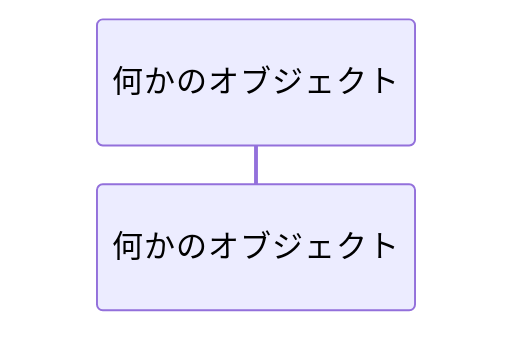
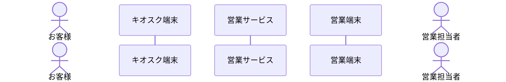
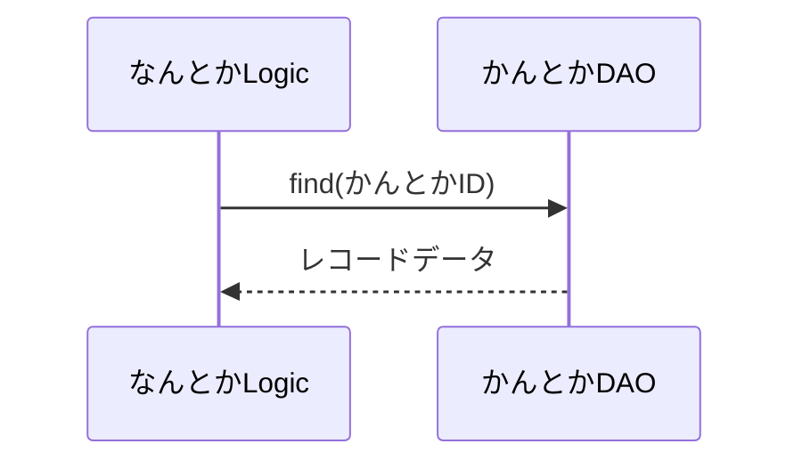
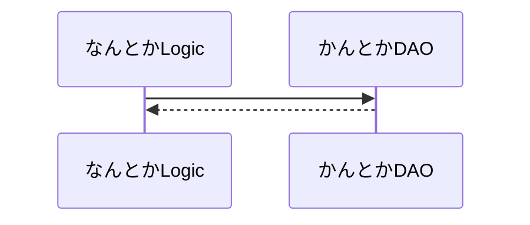
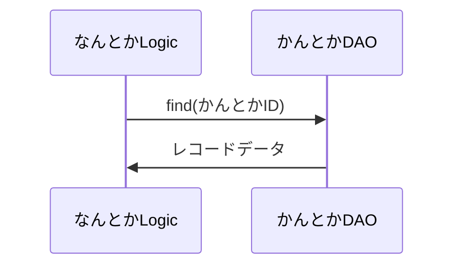
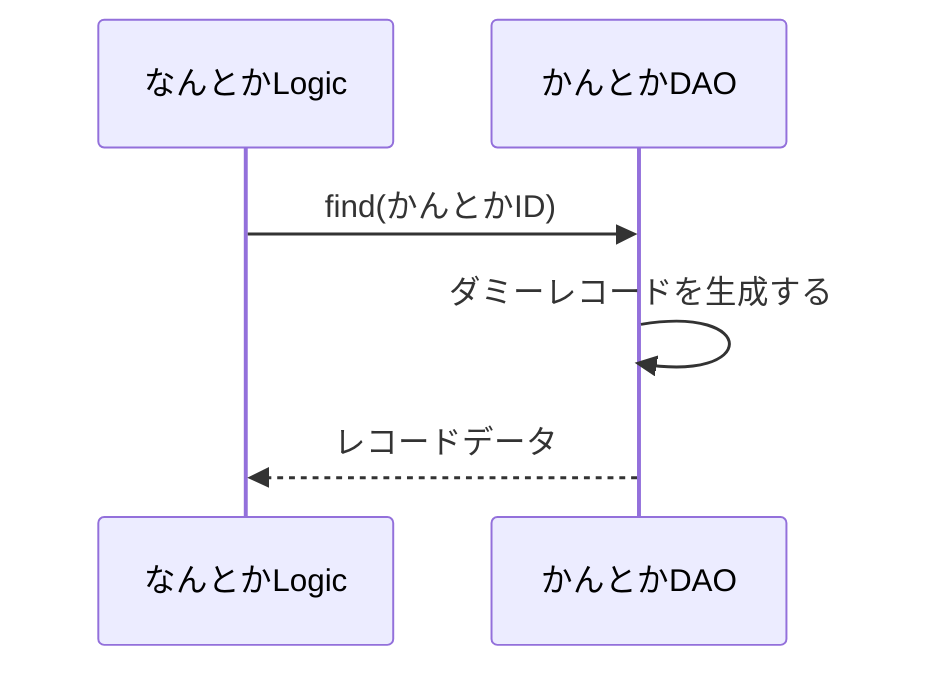
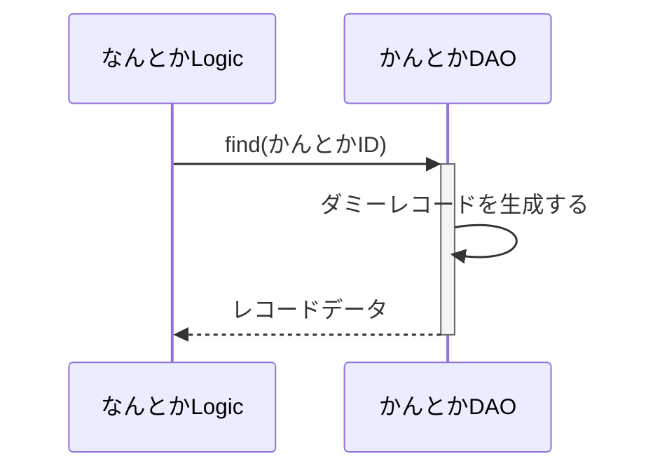
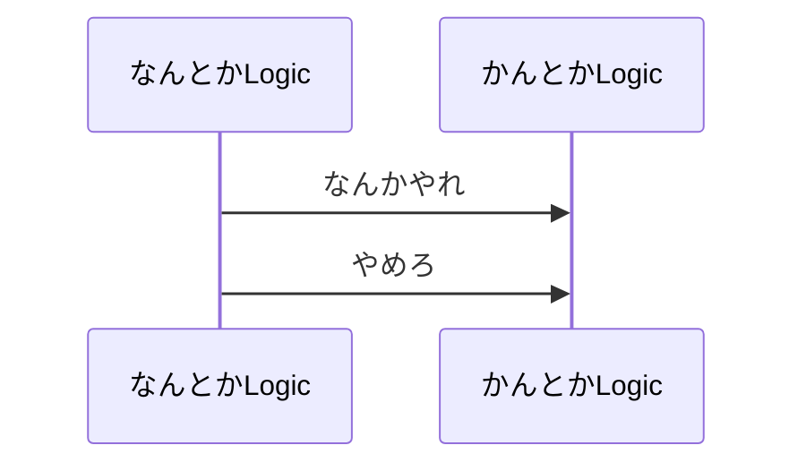
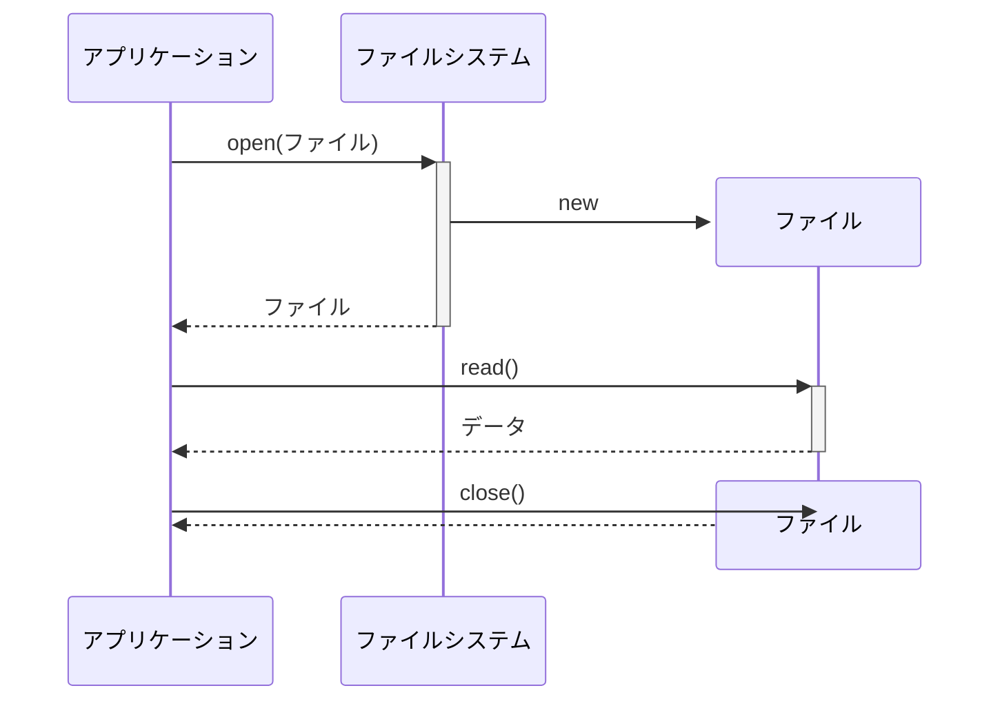

# シーケンス図について
Mermaidでのシーケンス図の描き方について簡単に見ていこうと思います。

GitHubではmarkdownファイルにコードブロックとして埋め込むことでMermaidでの図形記述が利用できます。

例えば参加者をmarkdownファイルに埋め込む場合には以下のように記述します。
~~~

~~~
上のように記述することでmarkdownファイルには以下のようにシーケンス図が表示されるようになります。

以下、シーケンス図の構成要素についてみていきます。
## アクターと参加者
アクターは`actor アクター名`、参加者は`participant 参加者名`で定義します。

アクターと参加者の例を示します。
~~~

~~~


アクターと参加者にはそれぞれ名前を付けますが、名前が重複するとエラーになります。

同じクラスのオブジェクトを複数扱うといった場合には名前の重複が必要となりますが、そういった場合の対応は次項で扱います。

### メッセージとリターン
メッセージ (メソッド呼び出しなど) は`送信元 ->> 受信先: [メッセージ]`の形式で記述し、メッセージに対する応答 (メソッドの戻りなど) は`送信元 -->> 受信先: [戻り値]`の形式で記述します。
~~~

~~~


参加者名が長い場合などは`participant 省略名 as 参加者名`の形式でアクターや参加者を記述すると、メッセージが分かりやすくなります。

また、省略名の重複はエラーとなりますが、省略名が異なっていれば参加者名が同一であっても問題はありません。省略名はシーケンス図上には表示されないので、同じ参加者名の参加者を複数記述する必要がある場合には省略名の利用が必須となります。
~~~

~~~


メッセージや戻り値は省略できますが、コロン (:) は省略できません。
~~~

~~~


Mermaidはお絵描きツールなので、Smalltalkのように相互にメッセージをわたす書き方も許容します。
~~~

~~~


自分自身へのメッセージも記述することができます。
~~~

~~~


### アクティベーションバー
アクティベーションバーを表示するには少し気持ちわるい書き方が必要です。

アクティベーションバーをアクティブにするにはアクティブになるメッセージの受信先にプラス (+) を記述し、インアクティブにするには戻りメッセージの受信先 (アクティベーションバーを記載する側ではないことに注意) にマイナス (-) を記述します。
~~~

~~~


アクティベーションバーがアクティブでない側からのメッセージでアクティベーションバーをインアクティブにできないことに注意が必要です。

このため以下のような記述にアクティベーションバーを表示することはできません (エラーになります)。
~~~

~~~


### 参加者の生成と削除
ここまではすべての参加者が図で表現された期間、ずっと生存している形の図を描いてきました。
場合によっては参加者であるオブジェクトの生成と削除を明示したい場合もあります。

そのような場合は、参加者が生成される時点で`create participant 参加者名`と明示的に生成を記述し、削除する時点で`destroy 参加者名`を記述します。

その際、参加者の生成、削除のきっかけとなるメッセージをこれらの直後に記述する必要があります。

ファイルからデータを読み込む例を描いてみます。
~~~

~~~


この例ではファイルシステムでファイルを開くとファイルオブジェクトが生成され、ファイルをクローズするとファイルオブジェクトが削除されるということを図示しています。

closeメソッドの矢印の位置が少し残念です。

参加者の削除はアクティベーションバーと異なりどちら向きのメッセージでも指定することができます。

~~~
```mermaid
sequenceDiagram
participant P as 呼ぶ側
create participant C as 呼ばれる側
P ->> C: new
destroy C
P ->> C: delete
```
~~~

```mermaid
sequenceDiagram
participant P as 呼ぶ側
create participant C as 呼ばれる側
P ->> C: new
destroy C
P ->> C: delete
```

しかし、参加者の生成は生成を指示する側から生成される側へのメッセージがないとエラーになります。

生成される参加者は同じ参加者名であっても新しい列に生成されます。

~~~
```mermaid
sequenceDiagram
participant P as 呼ぶ側
create participant C1 as 呼ばれる側
P ->> C1: new
destroy C1
C1 ->> P: done
create participant C2 as 呼ばれる側
P ->> C2: new
destroy C2
C2 ->> P: done
```
~~~

```mermaid
sequenceDiagram
participant P as 呼ぶ側
create participant C1 as 呼ばれる側
P ->> C1: new
destroy C1
C1 ->> P: done
create participant C2 as 呼ばれる側
P ->> C2: new
destroy C2
C2 ->> P: done
```
前にも触れましたが、上の例にあるように参加者の省略名は参加者の定義ごとに異なるものを設定する必要があります。また、同じ参加者名の参加者を複数使用する場合は省略名を必ず指定します。

## ループ、条件など
シーケンス図ではループや条件などを相互作用フレームとして記述することができます。

Mermaidでは相互作用フレームを以下のように記述していきます。

### ループ
ループの記述はループの先頭で`loop 継続条件`を記述し、繰り返すメッセージなどを記述した後で`end`でループの終了端を示します。

~~~
```mermaid
sequenceDiagram
participant AP as アプリケーション
participant FS as ファイルシステム
AP ->> +FS: open(ファイル)
create participant FILE as ファイル
FS ->> FILE: new
FS -->> -AP: ファイル
loop ファイル終端まで
  AP ->> +FILE: read()
  FILE -->> -AP: データ
end
AP ->> FILE: close()
destroy FILE
FILE -->> AP:
```
~~~

```mermaid
sequenceDiagram
participant AP as アプリケーション
participant FS as ファイルシステム
AP ->> +FS: open(ファイル)
create participant FILE as ファイル
FS ->> FILE: new
FS -->> -AP: ファイル
loop ファイル終端まで
  AP ->> +FILE: read()
  FILE -->> -AP: データ
end
AP ->> FILE: close()
destroy FILE
FILE -->> AP:
```
loopからendの間の字下げは必須ではありませんが、読みやすさの観点から字下げを行った方がいいと考えています。

### 条件
条件によって変わる動作を記述するにはoptとaltのどちらかを使用します。

optは記載の条件が成立した場合にだけ実行されるシーケンスを記述し、altは記載の条件が成立した場合と成立しなかった場合、それぞれで実行されるシーケンスを記述します。

特定の条件が成立した場合にのみ実行するシーケンスは`opt 条件`を先頭に記載した後、条件成立時に実行されるメッセージなどのシーケンスを記述し、`end`でシーケンスの終了を指定します。

条件が成立しなかった場合に実行するシーケンスも指定したい場合には`alt 条件`を先頭に記述し、条件成立時のシーケンスを記述した後で`else [条件]`を記述して条件不成立の場合のシーケンスを記述、最後に`end`を記述します。

elseの条件は省略もできますが、elseと書いておいた方が見やすくなると思います。else elseとなってちょっと気持ち悪いですけど。

~~~
```mermaid
sequenceDiagram
participant AP as アプリケーション
participant CN as コネクタ
AP ->> +CN: open(外部サービス)
opt 外部サービスが未接続
  create participant ES as 外部サービス
  CN ->> ES: connect()
  CN -->> -AP: コネクション
end
alt データ更新
  AP ->> +ES: fetch()
  ES -->> -AP: データ
  AP ->> +ES: update(更新データ)
  ES -->> -AP: 更新済みデータ
else else
  AP ->> +ES: fetch()
  ES -->> -AP: データ
end
AP ->> ES: close()
ES -->> AP:
```
~~~

```mermaid
sequenceDiagram
participant AP as アプリケーション
participant CN as コネクタ
AP ->> +CN: open(外部サービス)
opt 外部サービスが未接続
  create participant ES as 外部サービス
  CN ->> ES: connect()
  CN -->> -AP: コネクション
end
alt データ更新
  AP ->> +ES: fetch()
  ES -->> -AP: データ
  AP ->> +ES: update(更新データ)
  ES -->> -AP: 更新済みデータ
else else
  AP ->> +ES: fetch()
  ES -->> -AP: データ
end
AP ->> ES: close()
ES -->> AP:
```
## その他の記述形式
その他の記述形式として図面のタイトルと注釈、コメントの記述についてみておきます。

### 図面のタイトル
図面のタイトルはシーケンス図の範囲外の機能で、`sequenceDiagram`の前に例で示したように記述します。
~~~
```mermaid
---
title: 図面のタイトル
---
sequenceDiagram
  participant クラス1
  participant クラス2
```
~~~
```mermaid
---
title: 図面のタイトル
---
sequenceDiagram
  participant クラス1
  participant クラス2
```

### 注釈
シーケンス図では注釈を様々な形で記述することができます。

#### 参加者の生存線の左側、右側、上の注釈
注釈は生存線の左側、右側、上に置くことができ、それぞれ以下の形式で記述します
- 左: `Note left of 参加者: 注釈`
- 右: `Note right of 参加者: 注釈`
- 上: `Note over 参加者: 注釈`
注釈を複数行で記載したい場合には改行記号として`<br>`が使用できます。

~~~
```mermaid
sequenceDiagram
participant AP as アプリケーション
participant FS as ファイルシステム
AP ->> +FS: open(ファイル)
create participant FILE as ファイル
FS ->> FILE: new
Note left of FILE: ファイルオブジェクトの生成と<br>ファイルのオープン
FS -->> -AP: ファイル
loop ファイル終端まで
  AP ->> +FILE: read()
  Note right of FILE: ファイルを読み込む
  FILE -->> -AP: データ
end
AP ->> FILE: close()
Note over FILE: ファイルがクローズされたので<br>ファイルオブジェクトは無効になる
destroy FILE
FILE -->> AP:
```
~~~

```mermaid
sequenceDiagram
participant AP as アプリケーション
participant FS as ファイルシステム
AP ->> +FS: open(ファイル)
create participant FILE as ファイル
FS ->> FILE: new
Note left of FILE: ファイルオブジェクトの生成と<br>ファイルのオープン
FS -->> -AP: ファイル
loop ファイル終端まで
  AP ->> +FILE: read()
  Note right of FILE: ファイルを読み込む
  FILE -->> -AP: データ
end
AP ->> FILE: close()
Note over FILE: ファイルがクローズされたので<br>ファイルオブジェクトは無効になる
destroy FILE
FILE -->> AP:
```
注釈が配置される位置は想定どおり、注釈の前後にあるメッセージの間になります。

#### 複数の参加者の生存線にまたがる注釈
複数の参加者の生存線にまたがる注釈も記述することができます。

この場合は`Note over 参加者, 参加者: 注釈`という形式を使用します。注釈の両端が重なる参加者を順不同で指定できます。

~~~
```mermaid
sequenceDiagram
participant AP as アプリケーション
participant FS as ファイルシステム
AP ->> +FS: open(ファイル)
create participant FILE as ファイル
FS ->> FILE: new
Note over FILE, AP: ファイルオープンに失敗した場合の<br>動作は未定義
FS -->> -AP: ファイル
loop ファイル終端まで
  AP ->> +FILE: read()
  FILE -->> -AP: データ
end
AP ->> FILE: close()
destroy FILE
FILE -->> AP:
```
~~~

```mermaid
sequenceDiagram
participant AP as アプリケーション
participant FS as ファイルシステム
AP ->> +FS: open(ファイル)
create participant FILE as ファイル
FS ->> FILE: new
Note over FILE, AP: ファイルオープンに失敗した場合の<br>動作は未定義
FS -->> -AP: ファイル
loop ファイル終端まで
  AP ->> +FILE: read()
  FILE -->> -AP: データ
end
AP ->> FILE: close()
destroy FILE
FILE -->> AP:
```

### コメント
コメントは`%% コメント文字列`形式で記述します。

「%%」から行末までがコメントと扱われ、図面には影響しません。

## まとめ
以上、Mermaidでのシーケンス図の記述方法についてみてきました。

なお、公式サイトの以下のページにクラス図の文法詳細がありますので、参考にしてください。

[https://docs.mermaidchart.com/mermaid-oss/syntax/sequenceDiagram.html](https://docs.mermaidchart.com/mermaid-oss/syntax/sequenceDiagram.html)
